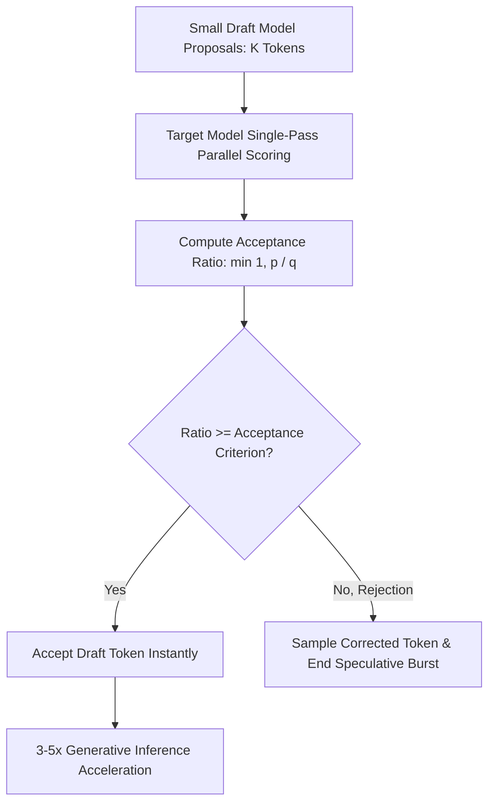

# GenPark AI Agent Skill - Speculative Decoding Draft Acceptance Evaluator

Implements rejection sampling and token verification routines to accelerate large LLM inference using fast draft models.

Verified by [GenPark AI](https://genpark.ai) and compatible with [Model Context Protocol (MCP)](https://genpark.ai/mcp).

## Architecture Diagram

## Features
- **Rejection Sampling Correctness**: Guarantees target distribution output mathematical equivalence.
- **Zero External Dependencies**: Pure Python 3.9+ standard library.
